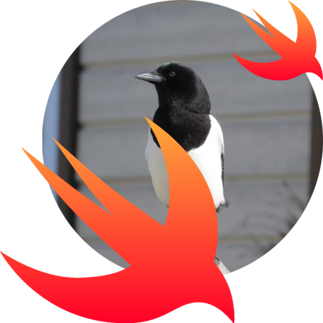
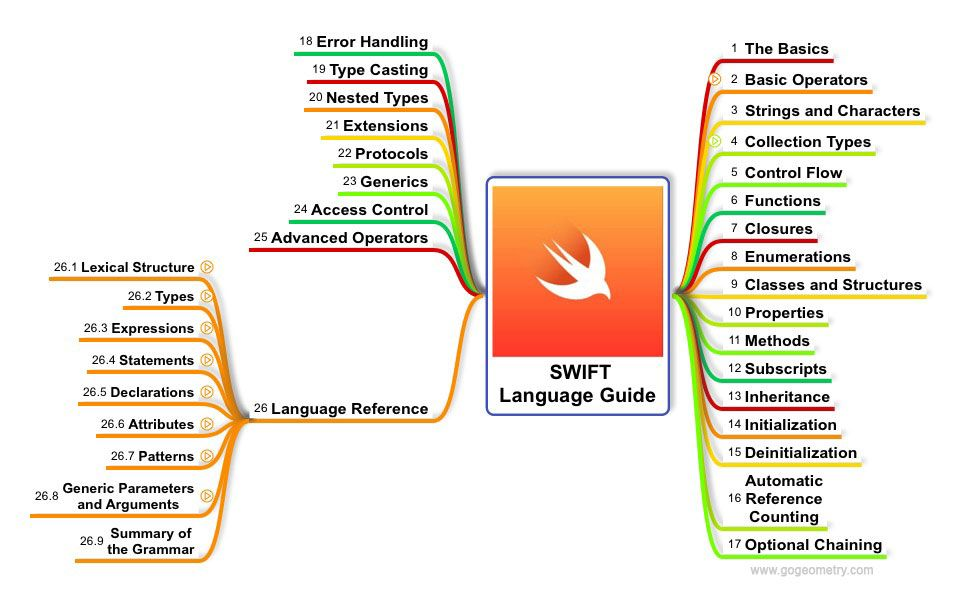

<p align="center"></p>

<h1 align="center">
    <strong>Swift</strong>
</h1>
<h3 align="center">
    Swift programming language
</h3>

<p align="left"></p>
*Swift Mind Map*


## Contents
- [Swift](#swift)
- [Installing Swift in Windows](#installing-swift-in-windows)
- [Variables](#variables)
- [Datatypes](#datatypes)
- [IF Statement](#if-statement)
- [Switch Statements](#switch-statements)
- [Loops](#loops)
- [Functions](#functions)
- [Classes](#classes)
- [Inheritance](#inheritance)
- [UIKit](#uikit)


## Swift
**Authors** - Chris Lattner, Doug Gregor, John McCall, Ted Kremenek, Joe Grof\
**Developer** - Apple Inc\
**First appeared** - June 2, 2014

https://swift.org/


## Installing Swift in Windows

1. Go to swiftforwindows.github.io , download Swift and install and run the program

2. Create text file named 'demo.swift' with following contents
```
import Swift
print("Hello World!")
```

3. Open that file in Swift program, click 'Compile' and then 'Run'\
Console will display: Hello World!

4. Klick 'Start', write 'Environment Variables' and klick 'Enter'

5. In 'User variables' select 'Path' and klick 'Edit'

6. Add swift folder path. By default 'C:\Swift\bin'

7. Now to check the swift version open command prompt 'cmd' and type:
´´´
swift --version
´´´

8. Locate your 'demo.swift' file in command prompt and run it by writing 
```
swift demo.swift
```

9. Open Visual Studio Code and add following extensions
* Code Runner
* Swift Language

10. Try to run your 'demo.swift' in VSCode

If you get error *command 'code-runner.run' not found*\
Then open 'C:\Users*.vscode\extensions\formulahendry.code-runner-0.9.10/out/src/codeManager.js' and comment out following lines
```
line 12:
//const micromatch = require("micromatch");

line 225~236:

/* if (executor == null) {
const executorMapByGlob = this._config.get("executorMapByGlob");
if (executorMapByGlob) {
const fileBasename = path_1.basename(this._document.fileName);
for (const glob of Object.keys(executorMapByGlob)) {
if (micromatch.isMatch(fileBasename, glob)) {
executor = executorMapByGlob[glob];
break;
}
}
}
} */
```


## Variables
**// some comment** - single line comment
**/* some comment */*** - multi line comment

**var** - keyword to declare new variable

Declaring string variable. 
```
var str - "Hello World!"
```

**print** - keyword for printing out text

Already declared and assigned variables can be reassigned
```
var a = 1
a = 3
```

You cannot reassign different type of value(for example int to string variable)
```
var str = "Hello World!"
str = 4                   // Not allowed
```

Common practice of naming variables meanigful names and camelcase. For example
```
var myNumberOfApples = 19
```

**Constants** - variables that can not be reassgned
**let** - declaring constant. For example
```
let c = 10
```


## Datatypes
**String:**   - Piece of text\
**Int:**      - Whole numbers positive and negative\
**Float:**    - Decimal numbers\
**Double:**   - Large decimal numbers\
**Bool:**     - True or False

```
var str_1 = "Hello World!"      // String type variable
var str_2 = "3"

var a = 3                       // Integer type variable

var str_3 = String(28)          // Converting integer to string

var c:Float = 2.3               // Float type variable
var d:Double = 12.9             // Double type variable
var e:Bool = true               // Boolean type variable

print(Int(c))                   // Convverts float to integer
print(Int(d))                   // Converts double to integer
```


## if Statement
Comparsion operators:

* Equal to (a == b)
* Not equal to (a != b)
* Greater than (a > b)
* Less than (a < b)
* Greater than or equal to (a >= b)
* Less than or equal to (a <= b)

Logical operators:

*  Logical NOT (!a)
*  Logical AND (a && b)
*  Logical OR (a || b)

Conditional programming: if, else if, else
```
let a = 4

if a < 4
{
    print("only if a is less than 4")
}
else if a < 8 
{
    print("only if a is less than 8")
}
else
{
    print("nothing was true")
}
```

Example 2
```
let b = 10
let c = 1
let d = 3

if b < 4 || (c < 4 &&  d == 3) {
    print("branch 1")
}
else if b < 8 {
    print("branch 2")
}
else if b == 10 {
    print("branch 3")
}
else {
    print("nothing was true")
}
```

Not equal (!)
```
var first = 3
var second = 5

if first != second {
    print("first does'nt equal second")
}
```

```
    temperatureInFahrenheit = 90
    if temperatureInFahrenheit <= 32 {
        print("It's very cold. Consider wearing a scarf.")
    } else if temperatureInFahrenheit >= 86 {
        print("It's really warm. Don't forget to wear sunscreen.")
    } else {
        print("It's not that cold. Wear a t-shirt.")
    }
    // Prints "It's really warm. Don't forget to wear sunscreen."
```


## Switch statements
Switch statements let make decisions with your code
```
let someCharacter: Character = "z"
switch someCharacter {
case "a":
    print("The first letter of the alphabet")
case "z":
    print("The last letter of the alphabet")
default:
    print("Some other character")
}
// Prints "The last letter of the alphabet"
```

```
var someCharacter:Character = "c"

switch someCharacter {
    case "a":
        print("is an A")
    case "b", "c":                  // "b" OR "c"
        print("is a B or C")
    default:
        print("some fallback")
}
```


## Loops
To use when needed repeat pieces of code

For loop
```
for index in 1...15 {
    print("hello")          // Will be printed 15 times
    print(index)            // Will print numbers 1-15
}

for index in 1...5 {
    var sum = 0
    sum += index
    print(sum)              // prints out numbers 1-5
}
```

While loop repeats code while set condition is true
```
var counter = 5 

while counter > 0 {
    print("hello")          // Will ptint hello 5 times
    counter -= 1
}
```

Repeat-While loop - condition is at the end of loop
```
var counter_2 = -5

repeat {
    print("hello")       // Will print hello 1 time
    counter = counter - 1
} while counter_2 >
```


## Functions
https://docs.swift.org/swift-book/LanguageGuide/Functions.html
**func** - keyword to declare function
```
func addTwoNumbers(){
    let a = 1
    let b = 2
    let c = a + b

    print(c)                // prints out 3
}

addTwoNumbers()             // calling a function
```

Function with return value
```
func addNumbers() -> Int {  // -> Int - return type
    let a = 1
    let b = 1
    let c = a + b

    return c
}

let sum = addNumbers()       // assigning functions value to variable 'sum'

print(sum)
```

Function with 2 arguments(with argument name and parameter name)
```
func addTwoNumbers(using number1:Int, and number2:Int) -> Int {     // add two numbers using number1 and number2
    let a = number1
    let b = number2

    return a + b
}

let sum_2 = addTwoNumbers(using:2, and:2)

print(sum_2)
```

Function with only parameter name
```
func addMyNumbers(number1:Int, number2:Int) -> Int {
    let a = number1
    let b = number2

    return a + b
}

let sum_2 = addMyNumbers(number1:2, number2:2)

print(sum_2)
```

## Classes
https://docs.swift.org/swift-book/LanguageGuide/ClassesAndStructures.html
```
class BlogPost {

    var title = ""
    var body = ""
    var author = ""
    var numberOfComments = 0

    func addComment(){
        numberOfComments += 1
    }
}

let myPost = BlogPost()
myPost.title = "Hello Playground"
myPost.author = "Chris Ching"
myPost.body = "Hello"
myPost.addComment()
print(myPost.numberOfComments)          // print out 1

let mySecondPost = BlogPost()
mySecondPost.title = "Goodbye Playground"
mySecondPost.author = "John Travolta"
mySecondPost.body = "Hello"
print(mySecondPost.numberOfComments)    // print out 0
```

## Inheritance
https://docs.swift.org/swift-book/LanguageGuide/Inheritance.html
```
class Car {
    var topSpeed = 200

    func drive() {
        print("Driving at  \(topSpeed)")
    }
}

class Futurecar: Car {          // Inheriting from Car class

    override func drive(){      // Overriding drive method

        super.drive()           // Calls the parent class method
        print("Driving at \(topSpeed + 50)")
    }

    func fly() {
        print("Flying")
    }
}

let myRide = Car()
myRide.topSpeed
myRide.drive()

let myNewRide = Futurecar()
myNewRide.topSpeed
myNewRide.drive()
myNewRide.fly()
```

<p align="center"></p>

## UIKit
https://developer.apple.com/documentation/uikit
Construct and manage a graphical, event-driven user interface for your iOS or tvOS app. 
The UIKit framework provides the required infrastructure for your iOS or tvOS apps. It provides the window and view architecture for implementing your interface, the event handling infrastructure for delivering Multi-Touch and other types of input to your app, and the main run loop needed to manage interactions among the user, the system, and your app. Other features offered by the framework include animation support, document support, drawing and printing support, information about the current device, text management and display, search support, accessibility support, app extension support, and resource management.
